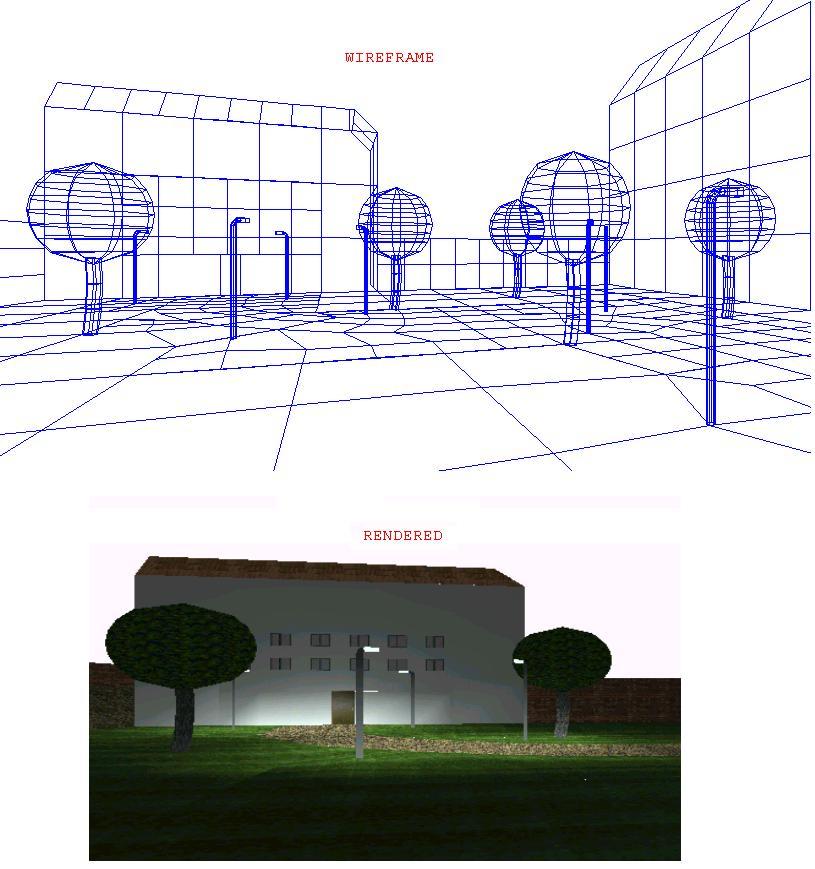



## A completly 3d CAD program, updated again\!

### Description

This is a completly 3d CAD program! You can edit and create ANY 3d object and open & save them. With this program, all 3d objects of the Shot It game were made. You can create a 3d object and edit, rotate, move, connect, stretch... it. The program supports textures, materials, directional & indirectional light sources, setting the visibility, preview the 3d object and much more things. A word help file about this program is also included in the directory DX Cad\Help. This is the updated version which fixes some bugs and makes the exporting to the Shot It game much easier. This program needs DirectX 7 or higher to run.

Check this out!

Known bugs: In combination of Win2000 and DirectX 8, the textures in the preview are looking very strange. So, run the program on another PC configuration!

Some people had a problem with loading the program because of an DirectDraw error. If you get an DirectDraw error, switch your desktop color depth to 16 bpp!

In Windows XP, you computer will reboot when trying to assign textures to polygons. I don't know why this bug accurs, and there is no solution on it except running the program not on WinXP.

Sorry for these things, but I hope you still like this program!
 
### More Info
 

             |
---                |---
**Submitted On**   |2001-07-30 16:39:54
**By**             |[Mathias Kunter](https://github.com/Planet-Source-Code/PSCIndex/blob/master/ByAuthor/mathias-kunter.md)
**Level**          |Advanced
**User Rating**    |4.9 (316 globes from 64 users)
**Compatibility**  |VB 6\.0
**Category**       |[Complete Applications](https://github.com/Planet-Source-Code/PSCIndex/blob/master/ByCategory/complete-applications__1-27.md)
**World**          |[Visual Basic](https://github.com/Planet-Source-Code/PSCIndex/blob/master/ByWorld/visual-basic.md)
**Archive File**   |[A completl2376673020\.zip](https://github.com/Planet-Source-Code/mathias-kunter-a-completly-3d-cad-program-updated-again__1-24614/archive/master.zip)

